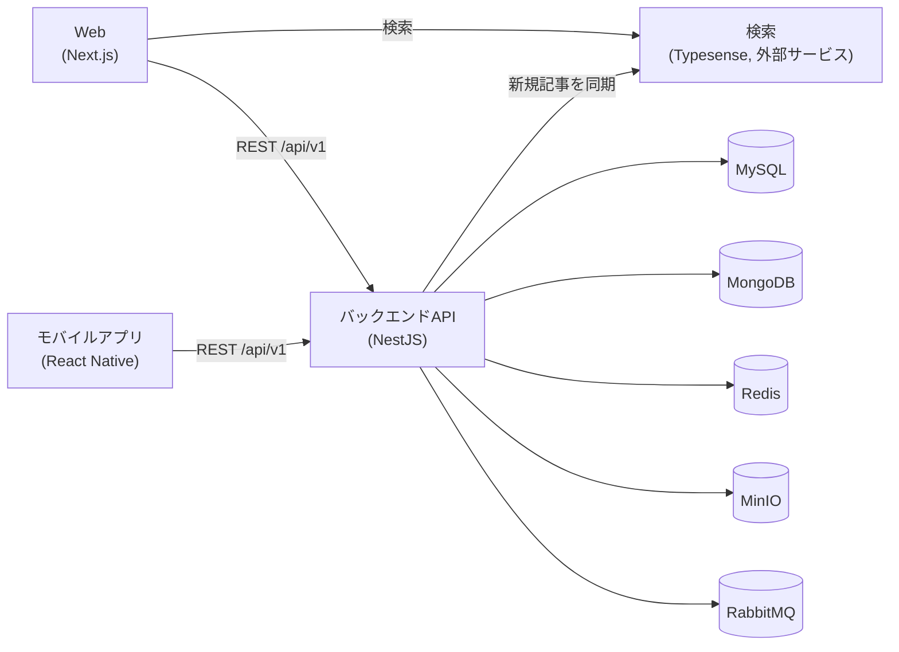

# NihonTechHub

[English](README.md) | **日本語**

> AIがキュレーションするテクノロジーニュースプラットフォーム。NihonTechHubはTechCrunch、9to5Mac、9to5Google、BestList.aiをクロールしてAI要約を生成し、関連記事を横断的に統合した「ハイライト」を作成、業界の主要な出来事をタイムラインで追跡します。これらすべてをWebアプリ、iOS/Androidモバイルアプリ、検索APIを通じて提供します。

## 目次

- [アーキテクチャ](#アーキテクチャ)
- [リポジトリ構成](#リポジトリ構成)
- [技術スタック](#技術スタック)
- [前提条件](#前提条件)
- [デプロイ](#デプロイ)
  - [Web — nihontechhub-web](#web--nihontechhub-web)
  - [バックエンドAPI — nihontechhub-be](#バックエンドapi--nihontechhub-be)
  - [モバイルアプリ — nihontechhub-app](#モバイルアプリ--nihontechhub-app)
  - [検索 — Typesense](#検索--typesense)
- [環境変数](#環境変数)
- [セキュリティに関する注意事項](#セキュリティに関する注意事項)
- [ライセンス](#ライセンス)

## アーキテクチャ



## リポジトリ構成

```
nihontechhub/
├── nihontechhub-web/    # Next.js 15 (App Router) Webフロントエンド
├── nihontechhub-be/     # NestJSバックエンドAPI
├── nihontechhub-app/    # React Native (bare) モバイルアプリ — iOS + Android
└── LICENSE
```

各プロジェクトは完全に独立しています（それぞれ独自の `package.json`、ロックファイル、Docker構成、CI設定を持ちます）— これはTurborepo/Nx/Lerna/workspacesのような管理型モノレポではなく、単純な複数プロジェクトのフォルダです。Typesenseはこのリポジトリには含まれておらず、WebとバックエンドがHTTP経由で通信する外部ホスト型サービスです。

## 技術スタック

| レイヤー | スタック |
|---|---|
| Web | Next.js 15、React、TanStack Query、Tailwind CSS |
| バックエンド | NestJS 10、MikroORM（MySQL + MongoDB）、Redis、MinIO、RabbitMQ、Agenda |
| モバイル | React Native 0.81（bare）、CodePushによるOTAアップデート |
| 検索 | Typesense（外部サービス） |
| 通知・認証 | Firebase（Cloud Messaging、Auth）、Google / Facebook / Apple Sign-In |

## 前提条件

- `nihontechhub-web` と `nihontechhub-app` はNode.js 20以上、`nihontechhub-be` はNode.js 22（Dockerfileのベースイメージに合わせる）
- Docker & Docker Compose — Webアプリとバックエンドの推奨実行方法
- モバイルビルド用: Xcode + CocoaPods（iOS）、Android Studio + JDK（Android）
- バックエンド用に到達可能なMySQL、MongoDB、Redis、MinIO、RabbitMQのインスタンス（このリポジトリ自体はこれらを用意しません）
- Firebaseプロジェクト（Cloud Messaging、ソーシャルログインを使う場合はAuthも）とTypesenseベースの検索エンドポイント

## デプロイ

### Web — nihontechhub-web

**ローカル開発**

```bash
cd nihontechhub-web
cp .env.example .env   # 実際の値を入力 — 環境変数セクション参照
npm install
npm run dev             # http://localhost:4889 （.envのPORT）
```

**Docker（推奨）**

```bash
cd nihontechhub-web
make development   # docker-compose.yml + docker-compose.development.yml、ホットリロード
make production    # マルチステージビルド → Next.js standaloneサーバー
make down            # 全て停止・削除
```

本番用イメージは `.next/standalone` をビルドし `node server.js` を実行、内部ではポート `3000` でリッスンし、ホスト側の `${PORT}` にマッピングされます。

**Dockerなしでの本番ビルド**

```bash
npm run build
npm run start
```

### バックエンドAPI — nihontechhub-be

**ローカル開発**

```bash
cd nihontechhub-be
cp .example.env .env   # 実際の値を入力 — 環境変数セクション参照
npm install
npm run dev              # NestJSウォッチモード
```

バックエンドには到達可能なMySQL、MongoDB、Redis、MinIO、RabbitMQのインスタンスが必要です（接続情報は `.env` に設定）— これらは別途用意するか、共有インフラを指定してください。このリポジトリ自体には含まれていません。

また、`src/common/config/configService.json` にFirebase Adminの**サービスアカウントキー**が必要です（テンプレートとして `configService.example.json` をコピーし、Firebase Console → プロジェクトの設定 → サービスアカウント → 新しい秘密鍵の生成 から取得した実際の値を入力してください）。実際のファイルは絶対にコミットしないでください — [セキュリティに関する注意事項](#セキュリティに関する注意事項)を参照。

**Docker**

```bash
cd nihontechhub-be
docker compose up -d --build
```

compose ファイルは `${NET_WORKS}` という名前の既存の外部Dockerネットワークに参加します — まだ存在しない場合は先に作成してください（`docker network create <name>`）。通常は上記のデータベース類と共有するネットワークです。

**データベーススキーマ**: MikroORMは起動時に `schemaGenerator.updateSchema()` を自動実行します（`AppModule.onModuleInit` 参照）— 管理下のMySQL/MongoDBエンティティに対して別途マイグレーション手順は不要です。（`typeorm:*` のnpmスクリプトはレガシーで、実際の起動処理では使用されていません。）

### モバイルアプリ — nihontechhub-app

**ローカル実行**

```bash
cd nihontechhub-app
npm install
npm run pod-install   # iOSのみ — 初回、またはネイティブ依存関係変更後
npm run ios             # または: npm run android
```

CodePushを使えばストア審査なしでJSのみの変更を即座に配信できます（詳細は [nihontechhub-app/readme.md](nihontechhub-app/readme.md) を参照）:

```bash
npx @recodepush/cli@latest create_bundle -t <targetVersion> -n nihontechhub_ios -d Production
npx @recodepush/cli@latest create_bundle -t <targetVersion> -n nihontechhub_android -d Production
```

バンドルID: `com.nihontechhub`（両プラットフォーム共通）。

### 検索 — Typesense

検索は外部ホスト型のTypesenseベースのエンドポイント（このデプロイでは `https://typesense.nihontechhub.com`）によって提供されており、**このリポジトリには含まれていません**。WebとバックエンドはそのURLを指定するだけで済みます:

- **Web**: `NEXT_PUBLIC_TYPESENSE_URL` — `GET {url}/news?search=...` に使用
- **バックエンド**: 記事が新規作成されるたびに `POST {そのホスト}/syncManyNews` へプッシュし（`nihontechhub-be/src/module/news/news.service.ts` 参照）、検索インデックスを最新に保ちます。

自前でホストする場合は、公式のTypesenseサーバー（[typesense.org/docs/guide/install-typesense](https://typesense.org/docs/guide/install-typesense.html)、通常はDocker経由）を、上記の `/syncManyNews` と `/news` エンドポイントを実装した簡易プロキシの背後で稼働させてください。

## 環境変数

各プロジェクトにサンプルファイルが用意されています — コピーして実際の値を入力し、本物の `.env` は絶対にコミットしないでください:

- `nihontechhub-web/.env.example`
- `nihontechhub-be/.example.env`

バックエンドの環境変数は用途別にグループ化されています: アプリURL・Swagger認証、MySQL、MongoDB、MinIO、RabbitMQ、JWT、SMTP、Redis、Sign in with Apple、Google/Facebook OAuth、Grafana/Loki（オブザーバビリティ）、Resend（メール送信）、Dockerネットワーク設定 — 完全な一覧はファイルを参照してください。ほとんどはキー名から用途が分かります。

Firebase Webの設定は、同期が必要な2箇所に存在します（Service Workerは `process.env` を読み込めないため）: `nihontechhub-web/.env` と `nihontechhub-web/public/firebase-messaging-sw.js` です。SDK設定は **Firebase Console → プロジェクトの設定 → 全般 → マイアプリ → Webアプリ** から、VAPIDキーは **プロジェクトの設定 → Cloud Messaging → ウェブプッシュ証明書** から取得してください。

## セキュリティに関する注意事項

- `nihontechhub-be/src/common/config/configService.json` はFirebase Adminの**サービスアカウント秘密鍵**です — 実際の値を絶対にコミットせず、クライアント側のバンドルにも絶対に含めないでください。
- `.env`、`.env.local`、`production.env` など実際の認証情報を含むファイルはバージョン管理に含めないでください。
- バックエンドのTypesense同期処理は現在、環境変数ではなくソースコード内（`news.service.ts`）にハードコードされた `x-password` ヘッダーを送信しています — 実際のセキュリティ境界として扱う前に `.env` へ移行してください。

## ライセンス

MIT — [LICENSE](LICENSE) を参照してください。
