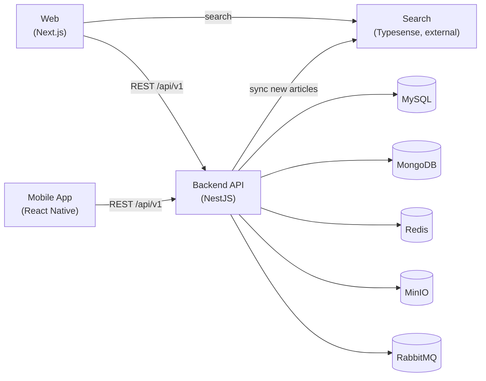

# NihonTechHub

**English** | [日本語](README.ja.md)

> An AI-curated technology news platform. NihonTechHub crawls TechCrunch, 9to5Mac, 9to5Google and BestList.ai, generates AI summaries, cross-references related coverage into curated "Highlights", tracks major industry moments on an event timeline, and delivers all of it through a Web app, an iOS/Android mobile app, and a search API.

## Table of Contents

- [Architecture](#architecture)
- [Repository Structure](#repository-structure)
- [Tech Stack](#tech-stack)
- [Prerequisites](#prerequisites)
- [Deployment](#deployment)
  - [Web — nihontechhub-web](#web--nihontechhub-web)
  - [Backend API — nihontechhub-be](#backend-api--nihontechhub-be)
  - [Mobile App — nihontechhub-app](#mobile-app--nihontechhub-app)
  - [Search — Typesense](#search--typesense)
- [Environment Variables](#environment-variables)
- [Security Notes](#security-notes)
- [License](#license)

## Architecture



## Repository Structure

```
nihontechhub/
├── nihontechhub-web/    # Next.js 15 (App Router) web frontend
├── nihontechhub-be/     # NestJS backend API
├── nihontechhub-app/    # React Native (bare) mobile app — iOS + Android
└── LICENSE
```

Each project is fully independent (its own `package.json`, lockfile, Docker setup, CI config) — this is a plain multi-project folder, not a managed monorepo (no Turborepo/Nx/Lerna/workspaces). Typesense is not part of this repository; it's an externally hosted service the web and backend talk to over HTTP.

## Tech Stack

| Layer | Stack |
|---|---|
| Web | Next.js 15, React, TanStack Query, Tailwind CSS |
| Backend | NestJS 10, MikroORM (MySQL + MongoDB), Redis, MinIO, RabbitMQ, Agenda |
| Mobile | React Native 0.81 (bare), CodePush OTA updates |
| Search | Typesense (external service) |
| Notifications / Auth | Firebase (Cloud Messaging, Auth), Google / Facebook / Apple Sign-In |

## Prerequisites

- Node.js 20+ for `nihontechhub-web` and `nihontechhub-app`; Node.js 22 for `nihontechhub-be` (matches its Dockerfile base image)
- Docker & Docker Compose — the recommended way to run the web app and backend
- For mobile builds: Xcode + CocoaPods (iOS), Android Studio + JDK (Android)
- Reachable instances of MySQL, MongoDB, Redis, MinIO and RabbitMQ for the backend (this repo does not provision them)
- A Firebase project (Cloud Messaging, and Auth if using social login) and a Typesense-backed search endpoint

## Deployment

### Web — nihontechhub-web

**Local development**

```bash
cd nihontechhub-web
cp .env.example .env   # fill in real values — see Environment Variables
npm install
npm run dev             # http://localhost:4889 (PORT from .env)
```

**Docker (recommended)**

```bash
cd nihontechhub-web
make development   # docker-compose.yml + docker-compose.development.yml, hot reload
make production    # multi-stage build → Next.js standalone server
make down            # stop and remove everything
```

The production image builds `.next/standalone` and runs `node server.js`, listening on port `3000` internally and mapped to `${PORT}` on the host.

**Manual production build (no Docker)**

```bash
npm run build
npm run start
```

### Backend API — nihontechhub-be

**Local development**

```bash
cd nihontechhub-be
cp .example.env .env   # fill in real values — see Environment Variables
npm install
npm run dev              # NestJS watch mode
```

The backend needs reachable MySQL, MongoDB, Redis, MinIO and RabbitMQ instances (connection details go in `.env`) — provision them separately or point at shared infrastructure; this repository doesn't bundle them.

It also needs a Firebase Admin **service-account key** at `src/common/config/configService.json` (copy `configService.example.json` as a template, fill it with real values from Firebase Console → Project settings → Service accounts → Generate new private key). Never commit the real file — see [Security Notes](#security-notes).

**Docker**

```bash
cd nihontechhub-be
docker compose up -d --build
```

The compose file joins an existing external Docker network named `${NET_WORKS}` — create it first if it doesn't exist yet (`docker network create <name>`), typically the same network shared with the databases/services above.

**Database schema**: MikroORM runs `schemaGenerator.updateSchema()` automatically on boot (see `AppModule.onModuleInit`) — no separate migration step is required for the MySQL/MongoDB entities it manages. (The `typeorm:*` npm scripts are legacy and unused by the app's actual bootstrap path.)

### Mobile App — nihontechhub-app

**Local run**

```bash
cd nihontechhub-app
npm install
npm run pod-install   # iOS only — first run, or after native dependency changes
npm run ios             # or: npm run android
```

Ship a JS-only change instantly with CodePush, no store review needed (see [nihontechhub-app/readme.md](nihontechhub-app/readme.md)):

```bash
npx @recodepush/cli@latest create_bundle -t <targetVersion> -n nihontechhub_ios -d Production
npx @recodepush/cli@latest create_bundle -t <targetVersion> -n nihontechhub_android -d Production
```

Bundle identifier: `com.nihontechhub` (both platforms).

### Search — Typesense

Search is served by an externally hosted, Typesense-backed endpoint (`https://typesense.nihontechhub.com` in this deployment) — it is **not part of this repository**. The web and backend only need a URL pointing at it:

- **Web**: `NEXT_PUBLIC_TYPESENSE_URL`, used for `GET {url}/news?search=...`
- **Backend**: pushes newly created articles to `POST {that host}/syncManyNews` whenever an article is created (see `nihontechhub-be/src/module/news/news.service.ts`), keeping the search index warm.

To self-host, run the official Typesense server ([typesense.org/docs/guide/install-typesense](https://typesense.org/docs/guide/install-typesense.html), typically via Docker) behind a thin proxy that implements the `/syncManyNews` and `/news` endpoints described above.

## Environment Variables

Each project ships an example file — copy it, fill in real values, and never commit the real one:

- `nihontechhub-web/.env.example`
- `nihontechhub-be/.example.env`

The backend's env vars are grouped by concern: app URLs & Swagger auth, MySQL, MongoDB, MinIO, RabbitMQ, JWT, SMTP, Redis, Sign in with Apple, Google/Facebook OAuth, Grafana/Loki (observability), Resend (transactional email), and Docker networking — see the file for the full list; most are self-explanatory from their key names.

Firebase Web config lives in two places that must be kept in sync (a service worker can't read `process.env`): `nihontechhub-web/.env` and `nihontechhub-web/public/firebase-messaging-sw.js`. Get the SDK config from **Firebase Console → Project settings → General → Your apps → Web app**, and the VAPID key from **Project settings → Cloud Messaging → Web Push certificates**.

## Security Notes

- `nihontechhub-be/src/common/config/configService.json` is a Firebase Admin **service-account private key** — never commit real values, never expose it to any client-side bundle.
- `.env`, `.env.local`, `production.env` and any other file holding real credentials must stay out of version control.
- The backend's Typesense sync call currently sends a hardcoded `x-password` header from source (`news.service.ts`) instead of an environment variable — move it to `.env` before treating it as an actual secret boundary.

## License

MIT — see [LICENSE](LICENSE).
